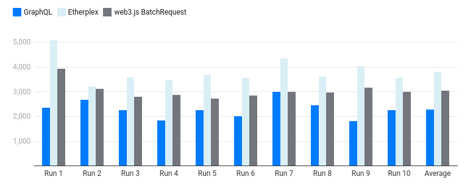

# Multicall benchmarks

We benchmark different methods of making many evm calls. One typical use case for this is retrieving a given address' balance on many different ERC20 tokens.

## Different methods

The different methods (ordered by conceptual difficulty) are
- parallel requests (multiple json-rpc queries)
- batched request (single json-rpc query that contains all the queries we want)
- multicall (single call to a contract which queries makes all the calls for us. TODO: use [etherplex](https://github.com/pooltogether/etherplex))
- static multicall (like multicall but without needing to deploy a contract. Makes use of constructor magic)
- GraphQL (eip-1767 alternative to json-rpc interface. Unfortunately not available on free node providers)

### static multicall wins for small number of calls (although there's very high variance)
```
> NUM_ROUNDS=25 node multicall.js
Multicall of 25 calls to chainlink ETHUSD price feed took 440s
> NUM_ROUNDS=25 node batchrequest.js
Executing a batch request of 25 requests to chainlink ETHUSD price feed took 502s
> NUM_ROUNDS=25 node parallelrequests.js
Executing 25 parallel requests to chainlink ETHUSD price feed took 668s
```

### But static multicalls [fail](https://github.com/indexed-finance/multicall/issues/6) when querying with too many calls
```
> NUM_ROUNDS=100 node multicall.js
{"jsonrpc":"2.0","id":46,"error":{"code":-32000,"message":"max code size exceeded"}}
> NUM_ROUNDS=100 node batchrequest.js
Executing a batch request of 100 requests to chainlink ETHUSD price feed took 922s
> NUM_ROUNDS=100 node parallelrequests.js
Executing 100 parallel requests to chainlink ETHUSD price feed took 2420s
```

## JSON-RPC equivalents
I often find it intuition sharpening to explicitly write out the underlying json-rpc calls that are being made.

Here's a batch request performed using curl
```
curl --request POST --url $INFURA_ETHEREUM_HTTPS --header 'Content-Type: application/json' --data '['\
'{"jsonrpc": "2.0", "id": 1, "method": "eth_blockNumber", "params": []},'\
'{"jsonrpc": "2.0", "id": 2, "method": "eth_blockNumber", "params": []},'\
'{"jsonrpc": "2.0", "id": 2, "method": "eth_blockNumber", "params": []}]'
```

## References

- Patrick Collins [What is Multicall](https://www.youtube.com/watch?v=EXas4uBqQr8)
- Chainstack: [The ultimate guide to getting multiple token balances on Ethereum](https://chainstack.com/the-ultimate-guide-to-getting-multiple-token-balances-on-ethereum/)

